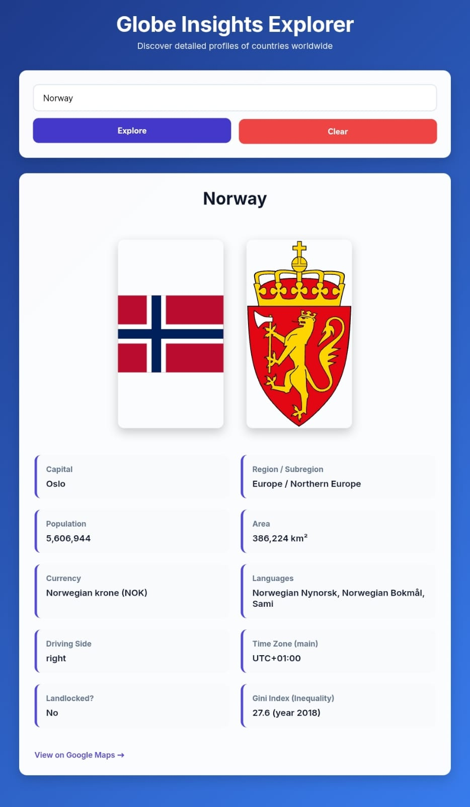
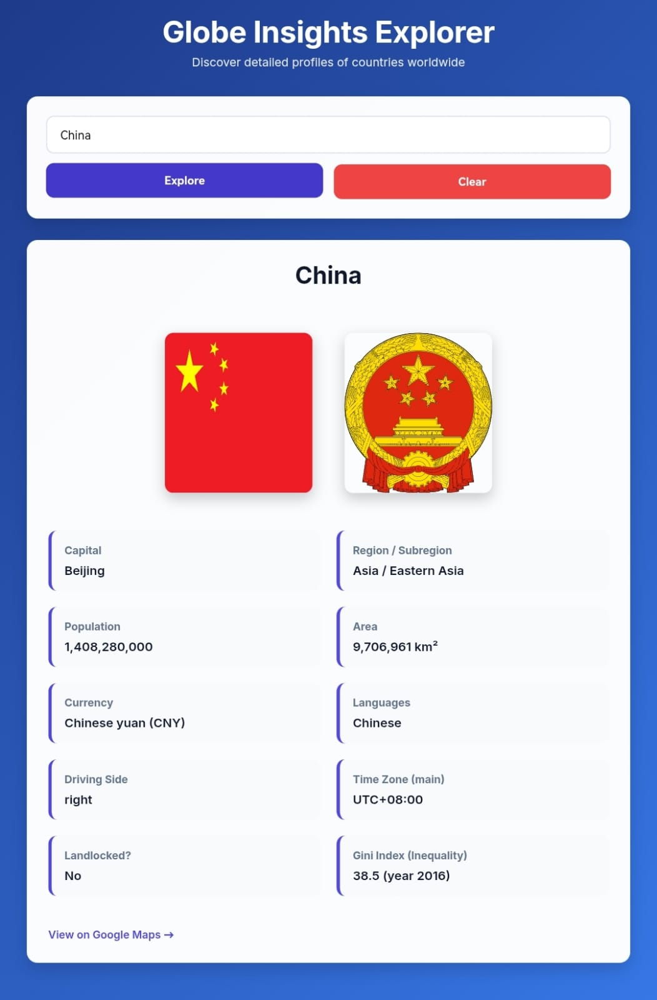
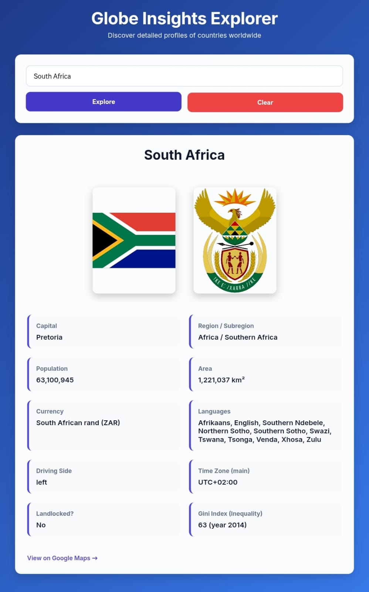
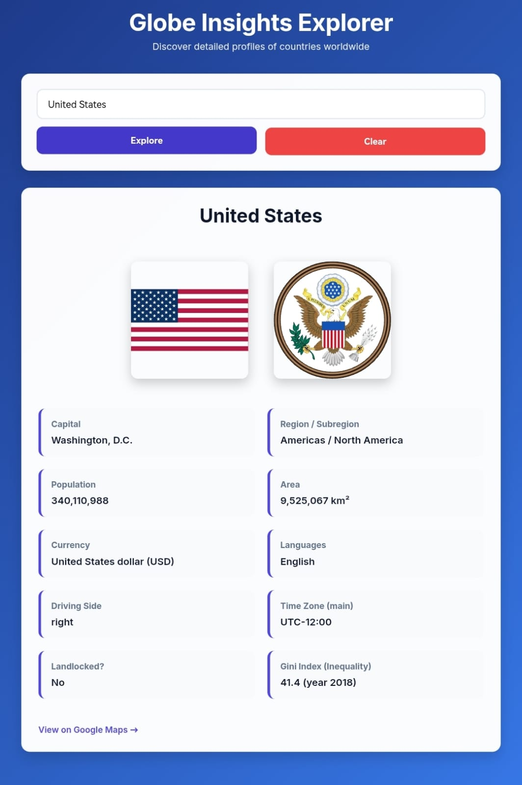

# Globe Insights Explorer 🌍

  
  
  
  
  
  

---

A clean, modern single-page web app to explore country information: flag, coat of arms, capital, population, currency, languages, driving side, time zones, Gini index, and more, powered by the free REST Countries API.

  
  
  
  

## Live Demo (No account/login needed)

Just click this link — it renders your HTML file directly in the browser:

**[Open Live Demo](https://wisemansg.github.io/globalinsightsexplorer/)**

## How to run locally (zero setup)

1. Download or copy the file (https://github.com/wisemansg/globalinsightsexplorer/blob/main/index.html)
2. Save it to your computer
3. Double-click the file — it opens in your browser and works offline (after first load, since it fetches data from the internet)

## Features

- Search any country (e.g. "Norway", "Japan", "Brazil")
- Shows flag + coat of arms (when available)
- Displays key facts in elegant cards
- Google Maps link
- Responsive design (mobile friendly)
- Loading & error states
- Press Enter to search

